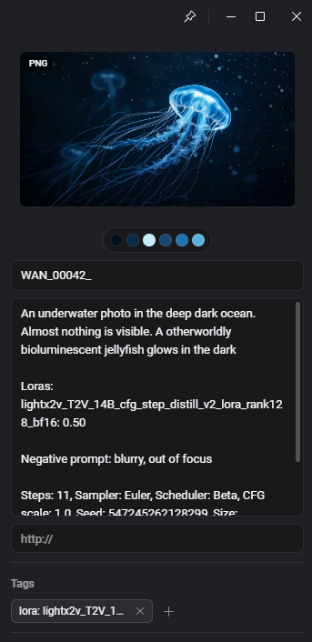

# Stable Diffusion Prompt Extractor for Eagle

  

A fast, robust metadata and prompt extractor for AI-generated images and videos.

Built as an **Eagle Plugin** to automatically add prompt information to the annotation window.
This provides a quick preview of which prompts and settings worked and which didn't.
It supports **ComfyUI** and **A1111 WebUI** (and its forks like reForge, and Neo).

Runs silently in the background, instantly extracting full generation metadata from all modern local models whenever
you add new files to Eagle.

---

## Features

### Eagle Plugin (Auto-Tagger & UI)

* **Background Auto-Tagging:** Automatically detects newly imported images/videos in Eagle and applies the generation
prompt to the "Annotation" field.
* **LoRA Tagging:** Extract LoRAs used in the generation and add them as Eagle Tags.
* **Version Stripping:** Optionally clean up your tag list by automatically stripping version numbers and epoch information from LoRAs
(e.g., `My_Lora_v2` and `My_Lora_v3` both become `lora: My_Lora`).
* **Manual Control UI:** Select any number of files inside Eagle and manually run the extractor. 
  * You can access the interface via the Eagle Plugin menu (Puzzle icon at the top > Service) or by simply pressing the P shortcut
  and then clicking on this plugin.

### Supported Platforms & Formats
* **Platforms:** ComfyUI, Automatic1111 (including Forks), CivitAI
* **Image Formats:** `.png`, `.jpg`, `.jpeg` 
* **Video Formats:** `.mp4`, `.mkv`, `.webm`, `.mov`

---

## Installation (Eagle Plugin)
1. Go to the [Releases](../../releases) page of this repository.
2. Download the latest `.eagleplugin` file.
3. Open Eagle, and double click the downloaded `.eagleplugin` file to install it.
4. The background auto-tagger will start immediately! Click the plugin icon in the Eagle toolbar (or press P)
to access the manual batch-processing UI.

Or alternatively: Open the plugin center inside Eagle and search for `Stable Diffusion Prompt Extractor` and
install it from there.

## License
This project is licensed under the [MIT License](./LICENSE). Feel free to fork and modify!